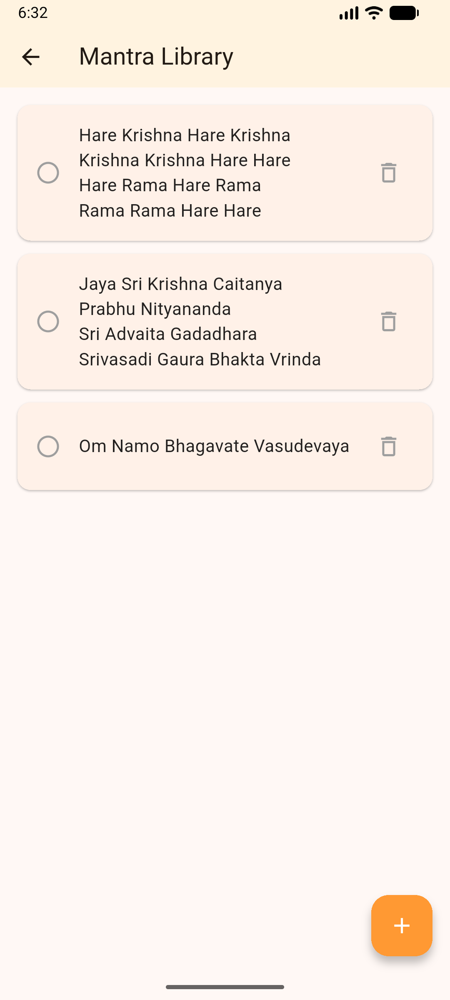
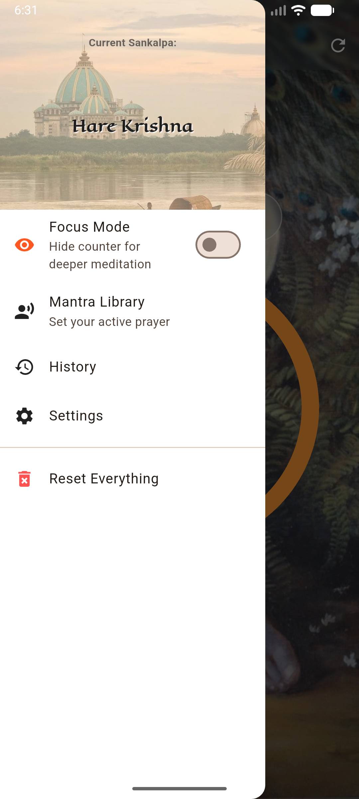

# 🕉️ Smaran - Digital Japa Counter App

<div align="center">
  
</div>

> *"Always chant and be happy."*

**Smaran** is a feature-rich, cross-platform mobile application built with **Flutter**. It serves as a modern spiritual tool for practitioners to track their Mantras (Japa) and Malas effortlessly. Designed with a focus on User Experience (UX), it mimics the tactile feel of traditional beads while offering advanced tracking features.

## 🚀 Features

### 📿 Core Chanting Functionality
- **108 Bead Logic:** Automatically counts up to 108 and increments the Mala counter.
- **Haptic Feedback:** Vibrations on every bead tap and a heavy impact on Mala completion for eyes-free usage.
- **Audio Cues:** Plays a soft bell sound upon completing a round.
- **Undo Capability:** Easily correct accidental taps.

### 🧠 Smart Features
- **Focus Mode:** A toggle switch that hides UI clutter (buttons, counters) for a distraction-free deep meditation session.
- **Daily Sankalpa:** Users can set a daily goal (e.g., 16 rounds). The UI dynamically displays progress (e.g., `Current / Goal`) in the AppBar.
- **Auto-Reset & History:** The app detects when a new day has started. If the user opens the app the next day, it automatically saves the previous day's data to a local History log and resets the counter for the fresh day.

### 📚 Mantra Library
- **Dynamic Drawer Header:** Users can add custom Mantras to a library.
- **Selection System:** Selecting a mantra updates the App Drawer header, effectively setting the "Theme" or "Mood" of the user's current spiritual practice.
- **Persisted Data:** All Mantras and selections are saved locally.

### 🎨 UI/UX Design
- **Immersive Aesthetics:** Features a vignette overlay on a spiritual background for depth.
- **Glassmorphism:** Uses `BackdropFilter` for modern, frosted-glass UI elements.
- **Responsive Layout:** Utilizes `Stack`, `Spacer`, and flexible widgets to ensure the app looks perfect on screens of all sizes.

## 🛠️ Tech Stack

- **Framework:** [Flutter](https://flutter.dev/) (Dart)
- **State Management:** `setState` (Clean & Minimalist approach)
- **Local Storage:** `shared_preferences` (For persisting counters, history, settings, and mantras)
- **Audio:** `audioplayers`
- **Fonts:** `google_fonts` (Cinzel / Eagle Lake / Lato)
- **System Info:** `package_info_plus` (For displaying app version)

## 📸 Screenshots

| Home Screen | Focus Mode | Mantra Library | Drawer Menu |
|:---:|:---:|:---:|:---:|
| Home Screen | Focus Mode | Mantra Library | Drawer Menu |
|:---:|:---:|:---:|:---:|
|  |  |  |  |


## 📲 Installation

1.  **Clone the repository:**
    ```bash
    git clone [https://github.com/your-username/smaran-app.git](https://github.com/your-username/smaran-app.git)
    ```
2.  **Navigate to the project directory:**
    ```bash
    cd smaran-app
    ```
3.  **Install dependencies:**
    ```bash
    flutter pub get
    ```
4.  **Run the app:**
    ```bash
    flutter run
    ```

## 🤝 Contributing

Contributions are welcome! If you have ideas for new features (e.g., cloud sync, meditation timer), feel free to fork the repository and submit a pull request.

1.  Fork the Project
2.  Create your Feature Branch (`git checkout -b feature/NewFeature`)
3.  Commit your Changes (`git commit -m 'Add some NewFeature'`)
4.  Push to the Branch (`git push origin feature/NewFeature`)
5.  Open a Pull Request

## All Rights Reserved ##
---

<center>
  <p>Created with ❤️ by <b>Hemant Raj Sen</b></p>
  <p><i>Innovate w/ Hemant</i></p>
</center>
